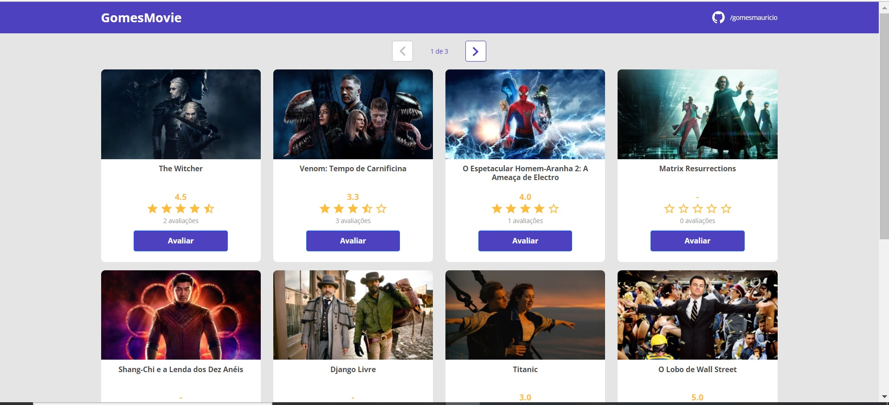

# dsmovie
Um projeto simples utilizando React Js com TypeScrip no frontEnd e Java Spring Rest no backEnd.
Basicamente o sistema exibe uma tela com cards de filmes, e salva  o email do usuario caso nao esteja cadastrado
Além de também salvar e exibir através das estrelinhas, as avaliações de cada filme pontuadas por cada usuário.  
Projeto realizado durante o evento DevSuperior   
#Link do projeto implantado na nuvem Netlify: 
https://mauricio-dsmovies.netlify.app/
Como esta no plano free da nuvem os dados podem demorar um pouco para aparecer

